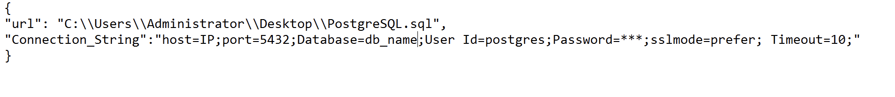

# SQL Update
 Taking sql file and updating db with it, with transaction and rollback if error (set to psql easy to change)
 
 ## Config file
 
  

1. url - Address to update sql file, with file name and extention

2. Connection_String - Connection String to your db (psql is if not changed in code)

## About 

Open this in PowerShell will not close on end and show u error message.
If u just open it it will do its job and close If mets error will show u message close app.
